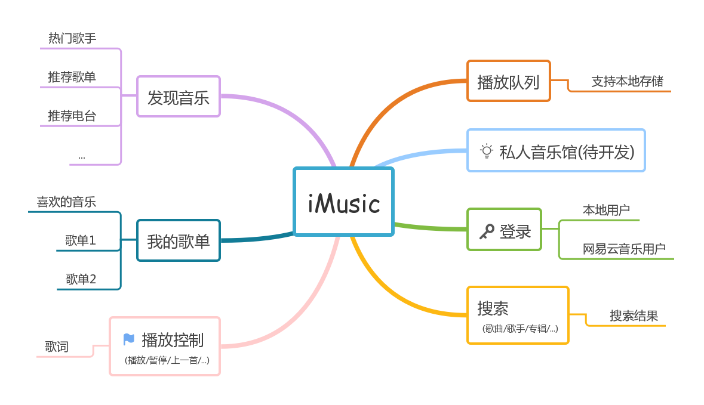
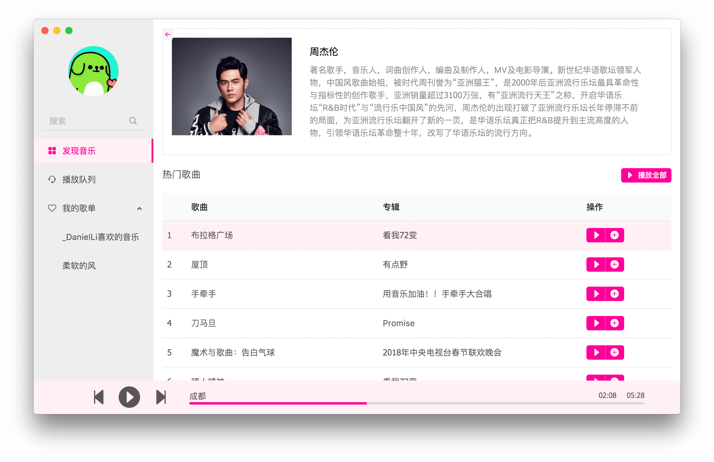
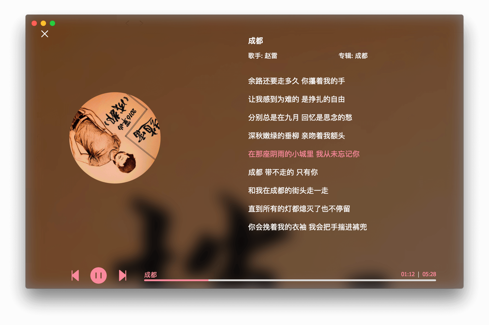

# iMusic

🎵一个基于 `React` 开发的音乐App。

感谢 [NeteaseCloudMusicApi](https://github.com/Binaryify/NeteaseCloudMusicApi) 提供的 API。

💪项目持续开发中...



## Screenshot





## 开发者

```
# download
git clone git@github.com:leezng/iMusic.git

# install dependencies
yarn

# run development environment
yarn dev
```

## LICENSE

[MIT](./LICENSE)
